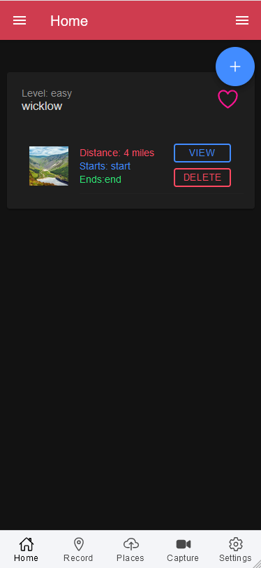
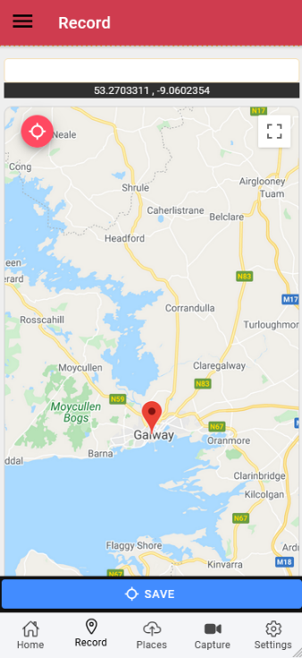
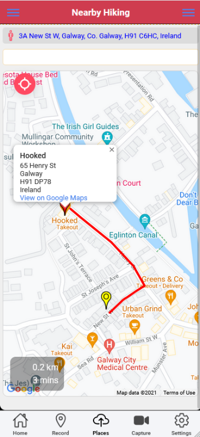
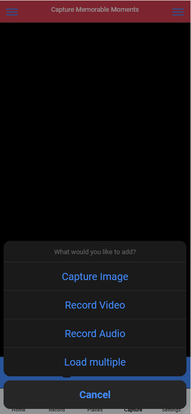
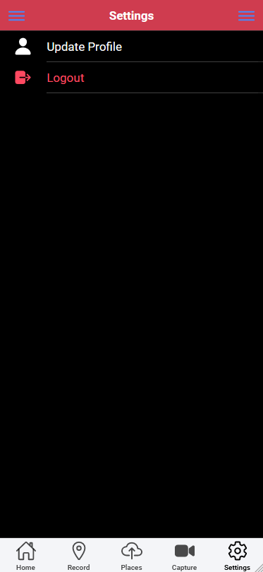
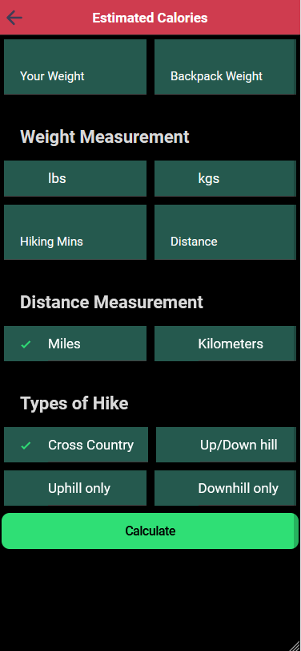

<h1 align="center">Applied Project & Minor Dissertation</h1>


<a href="https://www.gmit.ie/" >
<p align="center">
</p></a>

#### Irakli Lomidze - G00275525

***

# Project Details
| **Project Title** | Hiking Ireland |
| :------------- |:-------------|
| **Course**              | BSc (Hons) in Software Development |
| **Module**              | APPLIED PROJECT AND MINOR DISSERTATION |
| **Institute**           | [Galway-Mayo Institute of Technology](https://www.gmit.ie/) |
| **Student**             | [Irakli Lomidze](https://github.com/) |
| **Module Lecturer**      | Dr. Dominic Carr |

***

This application is based on Ionic & Angular User interface integrated with Firebase and Google API for maps, places , etc.


# About the Project
The major feature of the aplication is that the user can

1. Sign up 
2. Login 
3. Add to Favorite 
4. Record the trip with Google Maps
5. Search places with Google places
6. Capture picture
7. Capture Video
8. Record Audio
9. Upload 
10. View users list
11. VieW History
12. View News and Events
13. Calories calculator
14. View Favorites
15. Logout
16. Update Profile
17. Settings 
***

## Installation

```sh
npm install 
```

```sh
ionic serve
```

## Android

#### Creating Android App

```sh
npm install
```
```sh
ionic cordova platform add android
```
```sh
ionic cordova run android
```

# IOS

#### Creating iOS App

```sh
npx cap add ios
```
```sh
npx cap sync
```
```sh
npx cap copy 
```
```sh
npx cap open ios
```

### View list of plugins

```sh
npx cap ls
```

*******

# App Structure


### Pages

* All pages in this app are inside directory `src/app/pages`. 
* Pages folder contains 3 folders, `articles`, `authentication`, `home`. Rather than creating every page in a single directory I like to create them modular so they are easy to work with in my opinion.
* As you would have guessed by name `home` is the landing page of the app, `authentication` contains pages related to login and sign up and `articles` contains pages related to displaying the list of articles and individual articles which I will be adding soon.

### Services
* All services live inside directory `src/app/services`.
* Service `auth.service`, Manages the user authentication and authorization process.Integrated with Firebase using AngualrFireAuth and UserService to manage the user persistance and retrieval of user information from firebase. The service uses firebase UID and used as reference for user information persisted in firestore.
* Service `news.service`, Service is integrated with newsapi to fetch the news which are latest news in general. The service can also be used to retrieve filter news information related to hiking around globe or in ireland. The news service can also be used to retrieve relavent news based on usre location.
* Service `common.service`,The service is used to centralize the alert notifications to the user. This is utilized as common service across the application. The service showalert and showloader features that can be used across entire application.
* Service `covid.service`,The service is used to centralize the alert notifications to the user. This is utilized as common service across the application. The service showalert and showloader features that can be used across entire application.
* 
### Configuration

* Firebase `Firebase configuration`, Firebase configuration is provided in firebase.ts , You need to modify according to firebase configuration.
* Google `Google Maps`, Google Maps apikey configuration is provided in index.html. Please modify your google maps apikey
*******


## App Screenshots


|                                                              |                                                              |
| ------------------------------------------------------------ | ------------------------------------------------------------ |
| Home Page    | Record Page         |
|                                                              |                                                              |
| Places Page  | Capture Page  |
|                                                              |                                                              |
| Settings Page    | Calculator Page       |
|                                                              |                                                              |

###### END OF REAME
